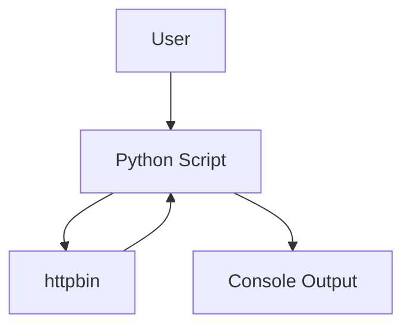

# API Query Script Documentation

## Overview
This project contains a simple Python script that sends a JSON POST request to
`https://httpbin.org/post` using the `requests` library. It prints the HTTP
status code and the JSON response returned by httpbin.

## API Endpoint and Parameters
- Endpoint: `POST https://httpbin.org/post`
- Timeout: `10` seconds
- Request body: JSON object with a single field:
  - `name` (string)

## Data Structure
### Request JSON
```json
{"name": "test"}
```

### Response JSON (httpbin)
httpbin returns a JSON object that includes fields such as `json`, `headers`,
`origin`, and `url`. The `json` field mirrors the request body.

## Mermaid Diagram


## Usage
1. Install dependencies:
  - `python -m pip install -r requirements.txt`
2. Run the script:
   - `python test_requests.py`

## Visual Evidence
- Add screenshots of the Cursor conversation and the rendered README (with the
  Mermaid diagram visible).
